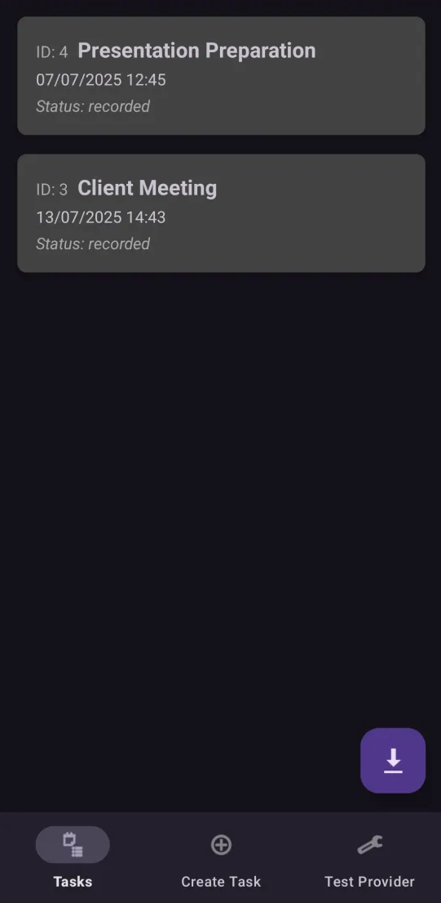
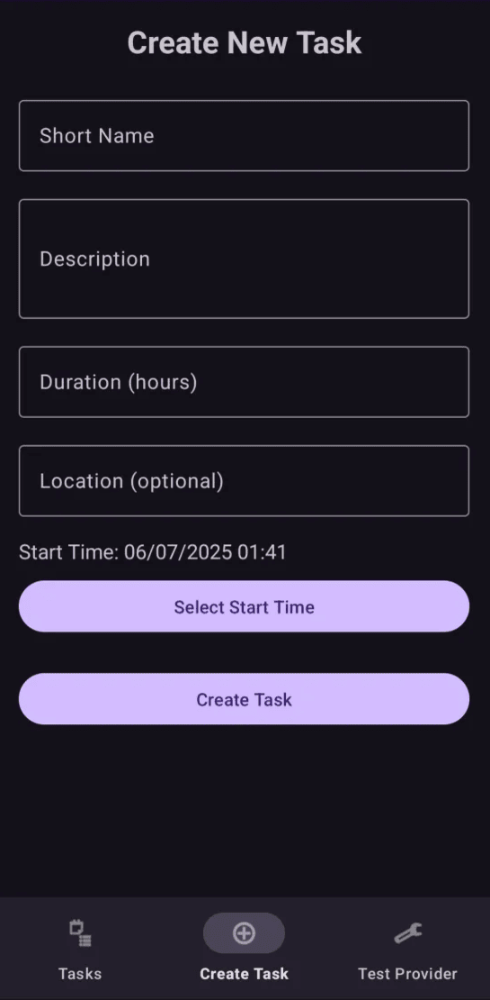
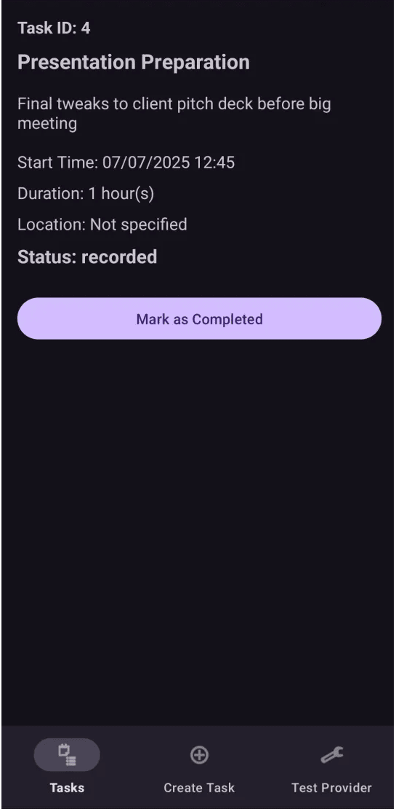
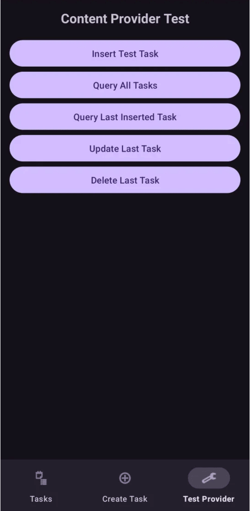

# Task Management App

A modern Android application for managing and organizing tasks efficiently. Built with Material Design 3 components and following Android architecture best practices.

<p align="center">
  
</p>


## Features

- Create and manage tasks with detailed information
- Task status tracking (in-progress, expired, recorded, completed)
- Material Design 3 UI components
- Content Provider implementation for data sharing
- Real-time task status updates
- Intuitive date and time selection
- Location support for tasks

## Screenshots

| Create Task | Task Details | Content Provider Test | 
|-----------|-------------|--------------|
|||


## Technical Details

### Architecture
- MVVM (Model-View-ViewModel) architecture
- Room Database for local storage
- Content Provider for data sharing
- Repository pattern for data management
- LiveData for reactive data handling

### Libraries Used
- AndroidX Components
- Room Persistence Library
- Material Design 3 Components
- ViewBinding
- LiveData and ViewModel

## Installation

1. Clone the repository
```bash
git clone https://github.com/KDim67/TaskManagement.git
```

2. Open the project in Android Studio

3. Sync the project with Gradle files

4. Build and run the application on your device or emulator

## Requirements

- Android Studio Arctic Fox (2020.3.1) or newer
- Minimum SDK: Android 6.0 (API level 23)
- Target SDK: Android 13 (API level 33)
- Java 11 or Kotlin 1.5+

## Usage

### Creating a Task
1. Navigate to the "Create" tab using the bottom navigation
2. Fill in the task details (title, description, duration, etc.)
3. Set the start time using the date/time picker
4. Optionally add a location
5. Submit the task

### Managing Tasks
- View all active tasks in the main task list
- Tap on a task to view its details
- Long-press a task to delete it
- Mark tasks as completed from the details screen

### Exporting Tasks
Use the floating action button on the task list screen to export your tasks to an HTML file.